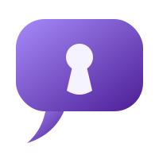

<p align="center">
  <a href="https://chatsec.app">
    
  </a>
</p>

# [ChatSec](https://chatsec.app)

**ChatSec** is an end-to-end encrypted, ephemeral chat application built with [Elixir](https://elixir-lang.org/) and the [Phoenix Framework](https://www.phoenixframework.org/). No accounts, no logs, no history — just a secure, private conversation.

---

## How it works

ChatSec uses **Elliptic-curve Diffie–Hellman (ECDH)** key exchange via the browser's native [Web Crypto API](https://developer.mozilla.org/en-US/docs/Web/API/Web_Crypto_API) to establish a shared secret between two users. All encryption and decryption happens entirely in the browser — the server never sees plaintext.

| Property | Detail |
|---|---|
| Max users per room | 2 |
| Encryption | AES-GCM with an ECDH-derived shared secret |
| Key generation | Web Crypto API (in-browser) |
| Connection verification | Fingerprint comparison (**Verify** button) |
| Data retention | None — keys and history are session-based |
| Logs / telemetry | None collected or stored |

**Message flow:**
1. The first user creates a room and generates an ECDH keypair.
2. The second user joins and generates their own keypair.
3. A handshake is performed automatically — both users derive the same shared secret, along with a **connection fingerprint** (see below).
4. All subsequent messages are encrypted with that secret before leaving the browser.
5. **Messages are broadcast only once** and never persisted.

Chat history is lost on room deletion, both users leaving, or a browser refresh. There is no way to recover it!

### Verifying your connection 🔎

A key exchange by itself only proves that *someone* completed a handshake — it doesn't prove that someone was the person you meant to talk to, and not a relay sitting in between (for instance, a compromised server quietly swapping in its own keys on each side and decrypting everything that passes through). Every chat room has a **Verify** button that shows a short fingerprint derived from both participants' public keys. Read it out to the other person over a call, in person, or any channel you trust — if it matches on both ends, nobody is intercepting your connection. This is the same idea as Signal's safety numbers or WhatsApp's security code, and it's worth doing for anything sensitive.

### Other hardening

Beyond the encryption itself: strict Content-Security-Policy, Permissions-Policy, and HSTS headers; server-side input validation and per-connection rate limiting on the chat channel; and no `unsafe-inline` anywhere in the CSP, since none of the app's JavaScript runs inline.

---

## Public instance 🤠

A public instance is available at [chatsec.app](https://chatsec.app).

---

## Self-hosting with Docker 🐳

ChatSec can be self-hosted using Docker and Docker Compose. Traefik is included as a reverse proxy and handles HTTPS.

> **Prerequisites:** `docker`, `docker compose`, a domain name with a valid SSL certificate.

### 1. Clone the repository

```sh
git clone https://github.com/smowggyayy/chatsec.git
cd chatsec
```

### 2. Generate a secret key

```sh
echo "SECRET_KEY_BASE=$(pwgen -y 64 1)" > .env
```

> Requires `pwgen`. Alternatively use `openssl rand -base64 64`.

### 3. Configure your domain

In `compose.yaml`, replace the domain references with your own:

```yaml
environment:
  PHX_HOST: "your-domain.com"
```

```yaml
labels:
  - "traefik.http.routers.chatsec.rule=Host(`your-domain.com`)"
```

### 4. Build and run

```sh
docker compose up -d --build
```

ChatSec will be available at `https://your-domain.com`. Traefik automatically redirects HTTP → HTTPS.
